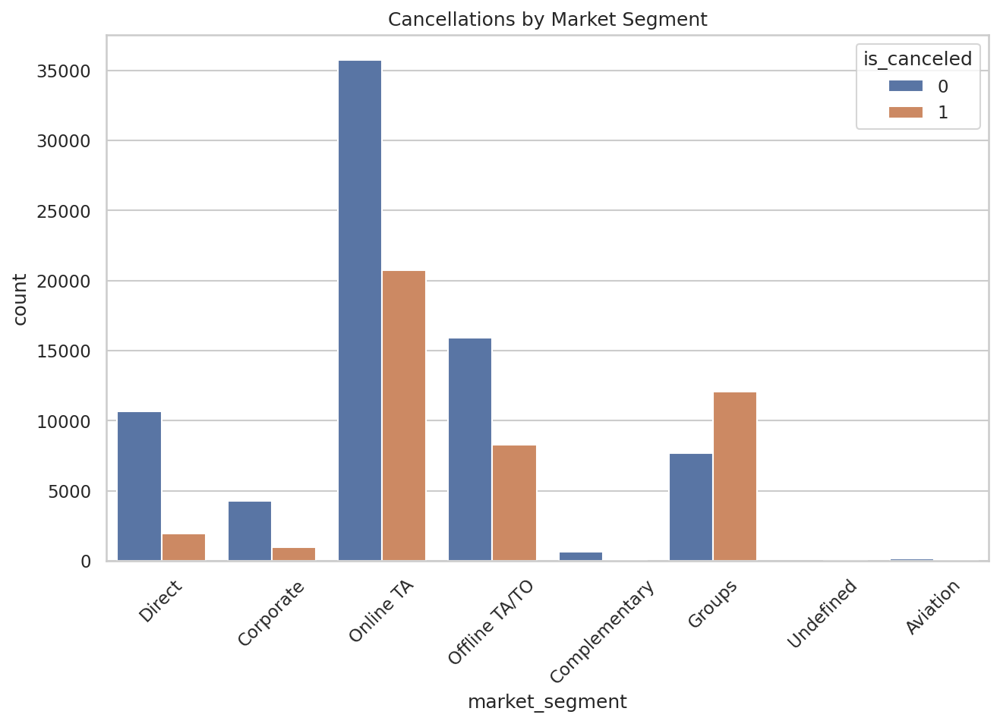

# Predicting Hotel Cancellations: A Data-Driven Approach to Revenue Protection

**One-line hook:** Using machine learning on 119,390 real bookings, this project identifies which reservations are most likely to cancel - giving hotel management the intelligence to act before the revenue disappears.

## 📓 Notebooks — Open in Google Colab:

https://colab.research.google.com/drive/1Q7fhucEUkrRt3t0VXXzuA16DHIkH_myq?usp=sharing

---

## The Business Problem

A Portuguese hotel chain is losing significant revenue to a 37% cancellation rate - meaning more than one in three reserved rooms ultimately sits empty. The hotel currently has no way to distinguish a high-risk booking from a reliable one at the time of reservation, forcing management into a reactive stance: either overbook aggressively (risking angry guests) or accept the losses. Without a predictive approach, the problem will only compound as online booking platforms make it increasingly easy for guests to cancel with no consequences.

## The Data

The analysis draws on 119,390 real bookings from a Portuguese city hotel and resort hotel spanning 2015–2017, sourced from the publicly available Hotel Booking Demand dataset. Each record captures the full lifecycle of a reservation — from how far in advance it was made, to the guest's history, room type, market channel, and pricing. The data was largely clean, with only minor missing geographic information that did not affect the core analysis.

## Key Discoveries

- **Long lead times are the #1 risk signal:** Guests who eventually cancel book nearly **twice as far in advance** as those who stay (144 days vs. 80 days). The further out a reservation is made, the more likely life — or a better deal — will intervene.

- **Special requests are a cancellation shield:** Guests who actually show up make more than **twice as many special requests** as those who cancel. Personalizing a stay creates psychological commitment. "Silent" bookings with zero requests are a hidden warning sign.

- **Price is not the culprit:** The Average Daily Rate (ADR) is nearly identical between cancelled and completed stays. Guests aren't leaving for cheaper rooms — they're simply changing plans. This means price cuts would be the wrong response to the cancellation problem.

- **Group bookings are the most volatile segment:** The "Groups" market is the **only segment where cancellations outnumber completed stays**. Direct and Corporate bookings are far more reliable, suggesting group contracts need fundamentally different risk controls.

- **Past behavior predicts future behavior — powerfully:** Guests who canceled had a previous cancellation rate **13 times higher** than guests who stayed. A small segment of "serial cancellers" is repeatedly consuming and releasing inventory, acting as if reservations are placeholders rather than commitments.

## Visualizing the Story

*Group bookings are the only market segment where cancellations outnumber completed stays — making them the single highest-priority target for stricter contract terms.*

## Prediction Model

A Decision Tree classifier (depth = 5) trained on booking behavior, lead time, market segment, special requests, and cancellation history achieved **74% accuracy** on a held-out test set of ~24,000 bookings. Translated into operations: for every 100 at-risk reservations the model flags, the hotel can take proactive action — requesting deposits, adjusting overbooking strategy, or reaching out to re-confirm — rather than discovering the cancellation at check-in. While no model is perfect, this represents a meaningful shift from guessing to evidence-based inventory management.

## Recommendations

1. **Implement tiered deposit policies for early bookings:** Require a non-refundable 25% deposit on any reservation made more than 90 days in advance. Our data shows this window carries the highest cancellation risk, and a financial commitment at booking time will filter out low-intention reservations before they consume inventory.

2. **Restructure group booking contracts:** The Groups segment is the only channel where cancellations consistently outnumber stays. Enforce earlier cut-off dates, higher deposit requirements, and stricter release-block deadlines so that large inventory commitments can be resold before it's too late to fill them.

3. **Deploy the predictive model for real-time risk scoring:** Integrate the Decision Tree model into the reservations workflow to flag high-risk bookings at the moment of confirmation. Front desk and revenue management teams can use these scores to prioritize outreach, adjust overbooking buffers by segment, and protect occupancy without antagonizing reliable guests.

## Tools & Techniques

Python | Pandas | Scikit-Learn | Matplotlib | Seaborn | Gaussian Naive Bayes | Decision Tree Classifier | Google Colab

---

*This project was completed as part of ISOM 835: Predictive Analytics at Suffolk University's Sawyer Business School.*
